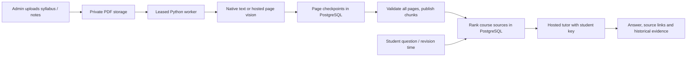

# Notes-grounded study tutor

Keep Next.js, PostgreSQL, private PDF storage and a small outbound Python worker. No local model weights, embedding download, vector service or C++/Go rewrite is required for this path. Existing vector columns are retained for compatibility; tutor retrieval uses PostgreSQL full-text search.



## Ingestion

Administrators select **Course notes / answer key** at `/upload`, choose a course and provide a title. Shared-passphrase contributors can upload papers only. Every PDF is limited to 25 MB and 200 pages. Notes do not require an active syllabus; paper analysis does.

Clean text-only pages use PyMuPDF text extraction. Pages with images, drawings, too little text or replacement characters use hosted vision, preserving equations, code and tables as text. Vision cannot guarantee a faithful interpretation of every diagram. All pages must finish before notes become available to students. Truncated, unreadable, missing or invalid page results keep the material private.

Each completed page is checkpointed with the PDF hash and extraction version. Ordinary retries reuse matching checkpoints, including after a free-tier quota failure. Provider `Retry-After` delays are bounded and respected; automatic retries stop after five attempts. Admin **Retry** retains checkpoints, while **Reanalyse** clears them and recomputes the document. Leases prevent a stale worker from publishing or altering an already completed result.

Published notes are split into page-preserving passages, at most 3,000 characters each with overlap. PostgreSQL ranks matches before limiting the result to six notes passages and four paper questions. Retrieval is course-scoped; exam and year filters apply to papers, while course notes remain available across those filters. Relevant older papers are searchable beyond the newest 40 uploads.

## Student study flow

Students sign in with Google and provide their Gemini or Groq key in page memory. Consecutive messages reuse that key; refresh, sign-out, removal and New chat clear it. It is sent to the server and selected provider for the request and is not written to browser storage or the database. Owner keys belong only on the ingestion worker. This project does not require paid AI usage; choose models available within your account's free quota. Exhausted quota causes a retryable failure rather than silently selecting a paid provider.

The composer supports explanations, practice and a revision plan with 15–720 available minutes. Historical priorities are calculated in PostgreSQL using distinct eligible papers, then allocated marks, then syllabus order. The evidence card comes from server calculations. Prerequisites, learning order, explanations and solutions remain model recommendations. Without eligible papers, the tutor explicitly receives an insufficient-data status and can still teach from syllabus, notes and general subject knowledge.

Answers prefer uploaded teaching sources, retain shared question instructions and disclose when using general knowledge or conflicting sources. Source markers link to notes pages or paper questions. Unknown citation numbers and unfinished provider responses are rejected. Model HTML, remote images and arbitrary links are suppressed in the renderer.

**Accuracy boundary:** source retrieval, schema checks and citation validation reduce errors; they do not prove that a generated claim follows from a citation, that a solution is correct or that an OCR transcription is faithful. The tutor remains able to answer broadly as requested. Use approved course notes/answer keys, and benchmark representative scanned pages and worked solutions before calling the system accurate for student study. No confidence percentage or guarantee is presented.

## Upgrade and run

From `frontend/`, apply migrations and regenerate the client before starting the updated app:

```sh
npm ci
npx prisma migrate deploy
npx prisma generate
npm run dev
```

The two new migrations are `20261007000000_notes_tutor` and `20261007000100_tutor_security`. They were applied successfully to the existing local app database on 2026-10-07, preserving existing records, and to a fresh isolated validation database. Production needs the same migration step. Never reset a populated database or apply the initial migration to an unbaselined installation.

For S3, update the bucket CORS configuration from `deploy/s3-cors.json`, replacing its origin with your app origin. PUT uploads now sign the declared size and `If-None-Match: *`; browser requests include that header to prevent overwriting an existing object. Test this against your real bucket before deployment. Local disk uploads are development-only.

Keep `TRUST_PROXY_HEADERS=0` unless a trusted reverse proxy overwrites forwarding headers. Vercel is detected automatically. If no trusted client address is available, upload limits use a shared fallback address. Tutor limits use the signed-in identity and persist across server instances. Configure separate random signing/internal secrets and keep all environment files private.

The production worker has no ML runtime or model weights. Its local environment was about 134 MB before optional developer tooling; pytest and pip-audit increase it to about 170 MB. Exact size varies by Python/platform. Install `worker/requirements.txt` for runtime, and `worker/requirements-dev.txt` only when testing. Browser checks can use an existing Chrome and temporary Playwright installation outside the repo.

## Verification commands

```sh
worker/venv/bin/pip install --no-cache-dir -r worker/requirements-dev.txt
worker/venv/bin/python -m pytest worker/tests -q
worker/venv/bin/python -m pip_audit
npm --prefix frontend run typecheck
npm --prefix frontend run lint
npm --prefix frontend audit
python3 scripts/check-secrets.py
```

Database tests write only to a database whose name is exactly `cpyq_notes_validation` and require `CPYQ_INTEGRATION=1`. For a local PostgreSQL configuration already in root `.env`:

```sh
python3 scripts/validate-local.py bootstrap
python3 scripts/validate-local.py test
python3 scripts/validate-local.py build --webpack
```

`validate-local.py` requires a localhost database and redirects its URL to the dedicated validation database. It never targets the app database. A local nonempty, unbaselined database is not reset by these scripts.

Optional browser checks need Playwright (`PLAYWRIGHT_MODULE`, default `/tmp/cpyq-browser/node_modules/playwright/index.mjs`) and Chrome (`BROWSER_EXECUTABLE`, default `/usr/bin/google-chrome-stable`). Start the isolated server on port 3100, then run the check in another terminal:

```sh
python3 scripts/validate-local.py dev --webpack --hostname 127.0.0.1 --port 3100
python3 scripts/validate-local.py browser
```

Integration mode uses `.next-validation`, keeping the existing dev server's build directory separate. The production build was verified with Webpack; this environment prevented Turbopack's internal socket startup. The normal project build remains available in environments that support it.

GitHub CI runs migrations, Node tests, typecheck, lint, a production build, Python tests, dependency audits and the secret-pattern check. Optional browser checks are local; they use mocked sign-in, AI and storage responses, and real page rendering/course queries.
