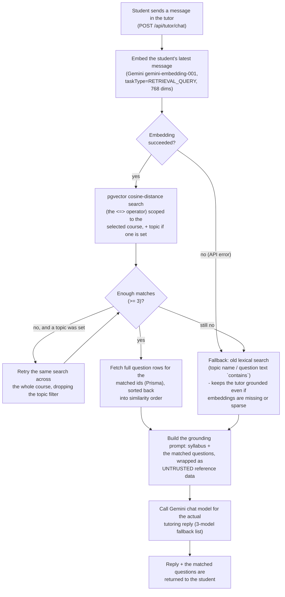

# How an upload becomes a searchable, tutor-grounded question

This traces exactly what happens from the moment a contributor uploads a scanned
question paper (PDF) to the moment its questions show up on `/papers` and get
cited by the academic tutor chat.

```mermaid
flowchart TD
    A["Contributor opens /upload,\nenters passphrase + course + file"] --> B["POST /api/upload/init\n(passphrase checked, rate-limited)"]
    B --> C["Browser PUTs file bytes to\n/api/local-upload?key=...&token=...\n(signed token minted by init)"]
    C --> D["POST /api/upload/finalize\ncreates File + Paper + ProcessingJob(PENDING)"]
    D --> E{"Worker reachable\nright now?"}
    E -- "yes: direct dispatch" --> F["POST worker /jobs/process"]
    E -- "no / missed" --> G["Worker's autonomous poller\n(polls /api/submissions every 15s)"]
    F --> H["POST /api/jobs/claim\natomically flips PENDING -> PROCESSING"]
    G --> H
    H --> I["DocumentProcessor.process_job() runs"]

    subgraph PIPE ["Ingestion pipeline (worker/src/pipeline/processor.py)"]
        I1["1. Download file from local_storage\n(path-traversal guarded)"] --> I2
        I2["2. SHA-256 hash + duplicate check\n(GET /api/files/check-hash)\n-> if duplicate, reuse old questions & skip to 6"] --> I3
        I3["3. OCR: render each PDF page to an image,\ntranscribe text (Tesseract, or GLM-OCR)"] --> I4
        I4["4. Segment into questions\n(Gemini call -> Q1(a), Q1(b), marks, text;\nregex fallback if Gemini fails)"] --> I5
        I5["5. Generate per-question PNG crops\nfrom the original PDF page"] --> I6
        I6["6. Classify each question's topic\n(one batched Gemini call against the\ncourse syllabus; lexical fallback if it fails)"] --> I6b
        I6b["6b. Embed each question's text\n(one batched Gemini embedding call,\ngemini-embedding-001, 768 dims,\ntaskType=RETRIEVAL_DOCUMENT)"] --> I7
        I7["7. Confidence check: OCR conf or topic conf\nbelow 0.80 -> REVIEW_REQUIRED, else COMPLETED\n(a missing embedding never affects this)"]
    end

    I --> I1
    I7 --> J["POST /api/jobs/update\n(worker's internal key required)\nupserts Question + QuestionTopic rows,\nwrites embedding via raw SQL (pgvector),\nsets File.sha256Hash, syncs Submission status"]
    J --> K["Paper + questions now visible on /papers\nand semantically searchable in the\nacademic tutor chat (/api/tutor/chat) - see below"]
```

## Notes on the flow

- **Two independent ways a job gets picked up**: the finalize route dispatches to the worker directly for low latency, *and* a background poller in the worker checks for any `PENDING` job every 15 seconds as a safety net (e.g. if the worker was mid-restart when the upload happened). Both paths go through the same atomic `/api/jobs/claim` call, so a job can only ever be picked up once — this is what stops the same paper from being processed twice.
- **Everything the worker knows about courses/syllabus/duplicates comes from the frontend's API** (`/api/courses`, `/api/files/check-hash`) — the worker has no direct database access by design.
- **Every fallback in the pipeline is intentional**: OCR falls back from GLM-OCR/Tesseract to raw PDF text extraction; question segmentation falls back from Gemini to a regex splitter; topic classification falls back from Gemini to a local keyword-overlap matcher. A paper never fails outright just because the LLM is briefly unavailable — it just gets flagged `REVIEW_REQUIRED` if confidence is low.
- **Cost note**: OCR (Tesseract/GLM-OCR) runs entirely locally at zero cost. The only paid-API-adjacent calls are the three Gemini calls per paper (segmentation + batch classification + batch embedding), all within Gemini's free tier for this project's scale.

---

# How the tutor finds questions by *meaning*, not just keywords

This is the semantic search / retrieval piece: how the academic tutor matches a
student's own words to exam questions that ask the same thing differently
(e.g. "how do I clean up a messy table with repeated data" retrieving a BCNF
normalization question, with zero words in common).

## Notes on this flow

- **Asymmetric embeddings, on purpose**: exam questions are embedded with `RETRIEVAL_DOCUMENT` (at ingestion time, see the pipeline above) and the student's message is embedded with `RETRIEVAL_QUERY` (here). Gemini's embedding model treats these two differently under the hood — using the matching type on each side is what makes the similarity comparison meaningful, not just dimension-compatible.
- **Prisma can't touch the vector column directly** — `Question.embedding` is a pgvector `vector(768)` column, declared `Unsupported(...)` in `schema.prisma`. Every read or write of it goes through raw SQL in `frontend/src/lib/embeddings.ts`, never the normal Prisma Client methods.
- **The lexical fallback isn't legacy code left lying around** — it's the deliberate safety net for courses whose papers were ingested before this feature existed (no embeddings yet) or where semantic search comes back too thin. The tutor is never left with zero grounding.
- **Cost note**: one extra Gemini embedding call per chat message (the query embedding), on top of the existing per-paper embedding calls at ingestion time. Both are within Gemini's free tier at this project's scale.
